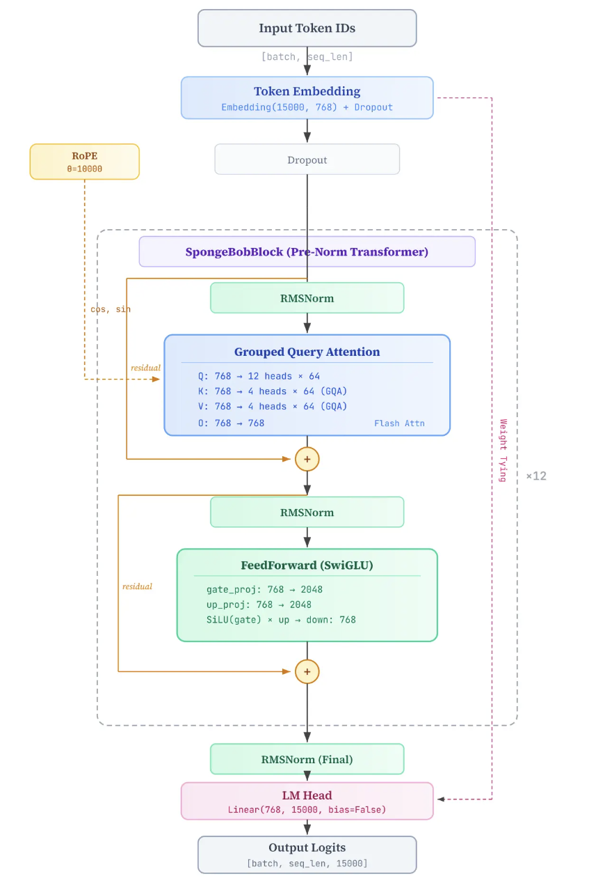
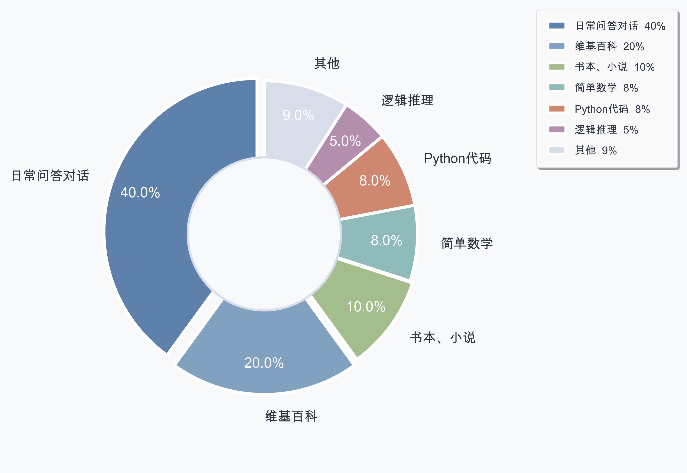

# SelfLLM-Pretrain-SFT: 大模型从0到1完整构建（预训练与SFT）

本次项目基于类 Qwen3 Dense 架构，实现了从 0 到 1 的 0.1B（约 82M）参数量级中文大语言模型手写及全链路训练。包含 Tokenizer 构建、预训练 (Pretrain)与有监督微调 (SFT) 评测体系构建。最终使模型具备中文多轮对话与指令跟随能力。
# 流程图：



# 基础组件：
模型配置代码：config.py

模型架构代码：定义了模型的架构和训练推理全流程细节：model_spongebob_pro.py (实现 RMSNorm, GQA, RoPE, SwiGLU 等)

预训练数据集：



下载命令：
```bash
modelscope download --dataset Harris/SpongeBobPRO SpongeBobPRO_pretrain_512_final.bin SpongeBobPRO_pretrain_512_final.meta --local_dir ./
```

分词器训练代码：
python train_tokenizer.py

对预训练数据进行前处理：将预训练数据分词后处理成所有样本都是512个满token的数据

python preprocess.py --input 预训练jsonl的路径  --output 输出文件的路径

数据集dataset类定义
定义了dataset类，方便之后进行数据加载
# 预训练 (Pretrain)：
预训练阶段使用了约 1.5B Token 的混合语料（对话 40%、百科 20%、文学 10%、数学/代码/推理 30%），旨在赋予模型基础的语言建模与物理世界认知能力。

预训练benchmark构建：

观测指标： 训练损失loss

预训练benchmark运行代码：evaluator.py

预训练代码:- pretrain.py

# 有监督微调 (SFT)：
SFT 的代码大量继承了 Pretrain 框架，最大的不同在于数据组织形式（对话格式）以及损失计算细节（Loss Masking，仅对 Assistant 的回复计算交叉熵损失，User 指令部分的 Label 设为 -100）。

1. SFT数据集与基座模型下载
SFT 阶段使用了 2M+ 条清洗后的问答对话数据。下载 SFT 数据 
 - modelscope download --dataset Harris/SpongeBobPRO  sft_spongebob.jsonl pretrain_768.pth  --local_dir ./


2. SFT 训练代码：train_sft.py

3.SFT推理代码：- eval.py
  - 修改eval.py中的model_path参数为训好的模型目录的pth
  - 修改eval.py中的model_type参数为sft
